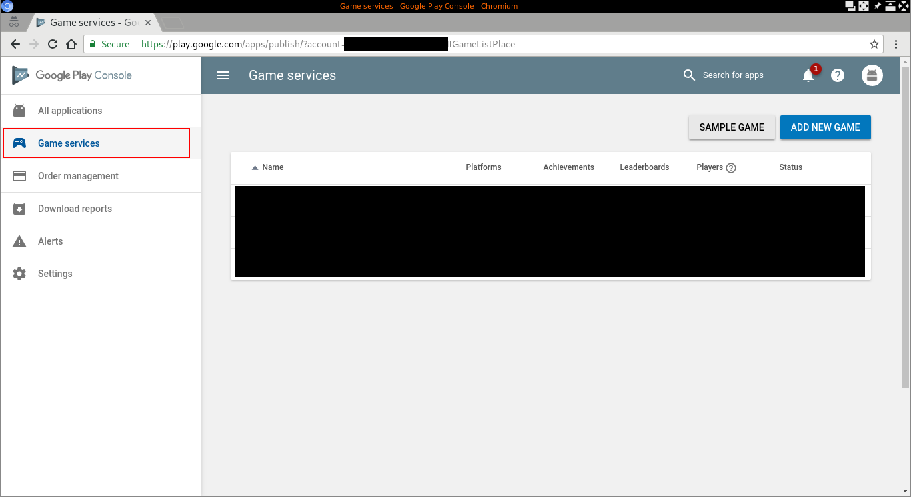
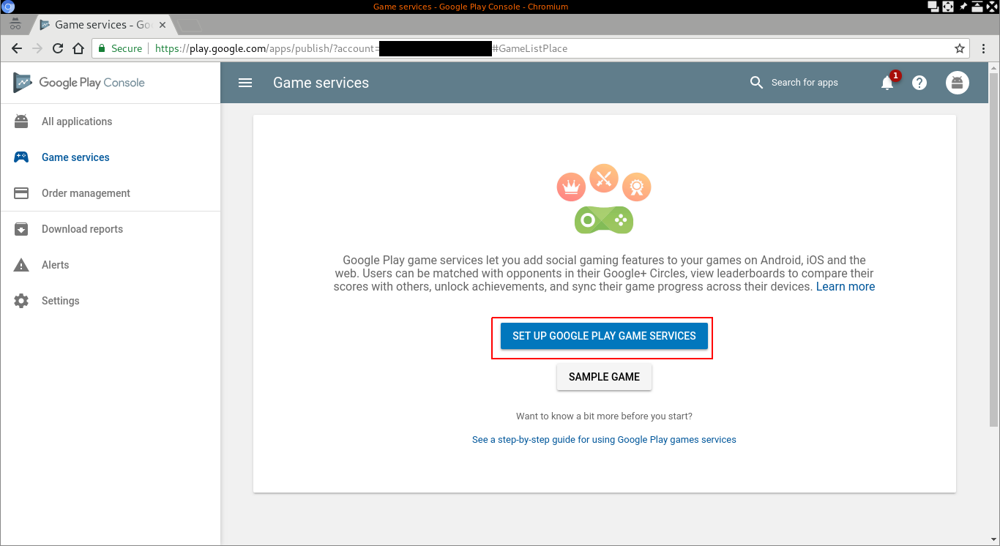
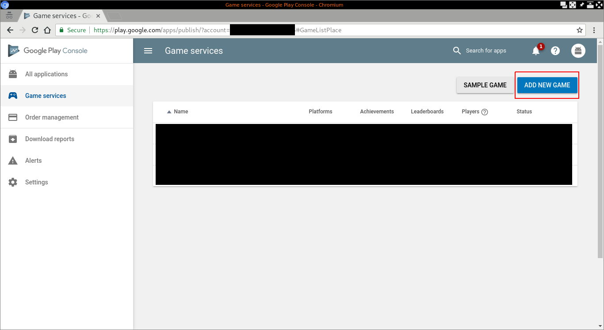

# Configuration required for GPGS Sign In

## Concepts: Don't mix the consoles!

Firstly, as stated already, GPGS stands for Google Play Games Services.

Google has three major consoles: Play Console, Cloud Console and Firebase Console.
 * [Google Play Console](https://play.google.com/apps/publish/) is related to publishing games on the Play Store and using the GPGS.
 * [Google Cloud Console](https://console.cloud.google.com) is the regular console for anything Google Cloud related (GAE, GCE, IAM, etc, etc).
 * [Firebase Console](https://console.firebase.google.com) is the console for Firebase related stuff, that are slowly being intertwined with GCP stuff.

 Firebase provides a very good generic authentication service, with lots of providers, including GPGS! But we will **not** be using that. We are going to sign in directly with GPGS, without Firebase. You might be using Firebase for other things, though (you most likely are).

 Don't get those mixed up!

## Create a GPGS project

Let's assume you already have your Application registered in Google Play Console; that is what allows you to have a Store listing, and publish your app. If you don't, you should be able to easily create one without problems.

That being set up, you need to create the Games Services project. That is a different thing! Access the [GPC](https://play.google.com/apps/publish), login if not already, and select *Game Services* on the left menu:



You might need to accept some lots of terms and conditions.

Now you need to create a new game; if this is your first time, you will need to click on the blue button *SET UP GOOGLE PLAY GAMES SERVICES* in the center of the screen.



Otherwise, click on the *ADD NEW GAME* blue button on the top right corner:



Either way, you will the the following dialog:


Fill both the name of the game and the category (you can copy from the Application you already have under *All applications*), and tap *CONTINUE*.

You will be taken to your game page. A few things need to be done here. In order to publish (you can test without Publishing), you need to fill the Game Details page (basically just copying details that you already filled on your Application). You will find out that an orange check in the menu means it's ok for testing, and a green one means it's ok to publish. You can refrain from filling these for now, as long as you follow the Testing procedures in the end. Otherwise, I'd recommend you already fill this so you won't forget anything later on.

## Link your App

This is the most unfriendly and cryptic part, so pay attention!

Firstly, you will need to get ahold of a couple things: your **package name** and **SHA-1 fingerprints**.

### Package Name

You porbably know your **package name** already, because you selected in the past. If you don't, the easiest place to find it is on your *AndroidManifest.xml* (android/app/src/main/AndroidManifest.xml), on the first line, on the <manifest> tag, package property.

However, there is a catch. This package name must be match in several places, otherwise, you will get errors. Make sure these four places match the same package name:

 * The folder structure (android/app/src/main/java/your/package/name);
 * The actual java files (`package your.package.name`);
 * Your AndroidManifest (android/app/src/main/AndroidManifest.xml), in the `manifest` tag, the `package` property; something like:

```xml
<manifest xmlns:android="http://schemas.android.com/apk/res/android" package="your.package.name">
```

 * Your app module gradle.build file (android/app/build.gradle), in android > defaultConfig > applicationId), something like:

```groovy
android {
    compileSdkVersion 27

    lintOptions {
        disable 'InvalidPackage'
    }

    defaultConfig {
        applicationId "your.package.name"
        ...
    }
}
```

Of course your actual Java packages might be subpackages of your **package name**, but they must start with the value on Android Manifest/applicationId. This base value is also the one you want to get ahold of for the purposes of this tutorial.

As per Java convention, you should always select a package name that represent a domain that your own (but reversed); e.g., com.yorudomain.subdomain.anything.

One very important thing to note here is:

> Note: Both the **com.example** and **com.android** namespaces are **forbidden** by Google Play.

From [here](https://developer.android.com/guide/topics/manifest/manifest-element#package), emphasis mine.

These might be the default names from your setup, but they will not work with any Google services and give cryptic errors.

### SHA-1 Fingerprint

Every APK is signed with a keystore... (TODO)

## Steps

The basic steps (need to elaborate)
 * Create the GPGS Project
 * Create the linked android app with proper package name and SHA-1 inside GPGS
 * Create also a webapp and get the id from that (NOT your android linked app)
 * Create at least one achievement to get your games-ids.xml file and place it accordingly
 * Remember to add yourself as tester if not published


